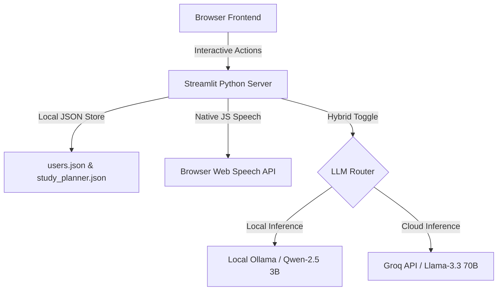

# MindFlex AI - Tech Stack & Architecture Report 🧠🚀

This report outlines the complete frontend, backend, database, APIs, and features utilized in **MindFlex AI - Emotion-Aware Virtual Learning Assistant**.

---

## 🏗️ System Architecture Overview

MindFlex AI is designed as a **Single-Process Web Application** for maximum speed, easy deployment, and low execution overhead. It combines client-side interactivity, server-side Python logic, and hybrid local/cloud LLM APIs into a unified dashboard.



---

## 🎨 1. Frontend Architecture (User Interface)

The frontend is built on **Streamlit (Python)**, styled with customized raw CSS injects to deliver a dark, premium, glassmorphic layout.

### A. Styling & Aesthetics
* **Glassmorphic Theme**: Utilizes HSL color tokens, semi-transparent backgrounds (`rgba`), backdrop blurs, and subtle neon border glows.
* **Typography**: Injects Google Fonts (*Plus Jakarta Sans*) globally to override standard browser fonts.
* **Responsive Collapsibles**: Customized expanders (`summary`/`details` selectors) using border-rotated CSS chevrons to prevent Broad Ligature overrides, ensuring clean layout rendering in offline environments.

### B. UI Component Breakdown
* **Unified Sign-In/Sign-Up Landing Page**:
  * **Left Column**: High-fidelity AI Capabilities grid (Emotion explanations, sentiment checks, speech synthesis, and concept labs).
  * **Right Column**: Tabs-based credential cards (`🔑 Sign In` / `📝 Sign Up`) with instant error validation prompts.
* **Personalized Student Dashboard**:
  * **Sidebar**: Student welcome card, dynamic breathing pulse status avatar showing active tutor state (Focused, Confused, Engaged), state counter tracker, and a logout button.
  * **📚 Learning Dashboard Tab**: 
    * Subject/Topic selector dropdown.
    * Interactive accordions displaying incremental lesson walkthroughs.
    * Multi-subject interactive playground calculators (Algebra discriminant solver, Calculus variable substitution animator, Physics kinetic energy work metric slider).
  * **📅 Study Planner Tab**:
    * Core metrics row displaying total logged topics, average score, mastered counts, and weak areas.
    * **📅 Schedule sub-tab**: Generates a custom 3-day revision/learning plan.
    * **📚 My Topics sub-tab**: Lists logged topic scores with individual progress meters.
    * **➕ Log Topic sub-tab**: Form to record quiz outcomes (0-100) and update schedules.

---

## ⚙️ 2. Backend & Integration Logic

The backend logic runs natively inside Streamlit's reactive execution thread.

### A. Natural Language Processing (LLM Integrations)
The system supports a **Dual-LLM configuration** toggleable in real-time:
1. **🤖 Local Ollama (100% Offline)**:
   * **Model**: `qwen2.5:3b`
   * **Connection**: Direct local loopback request (`http://127.0.0.1:11434/api/chat`).
2. **⚡ Groq Cloud (Ultra-Fast API)**:
   * **Model**: `llama-3.3-70b-versatile`
   * **Connection**: Raw HTTPS POST request to Groq API endpoint (~1000 tokens/sec generation).
   * **API Key Resolver**: Checks Streamlit Cloud `st.secrets` first (ideal for live hosting), then falls back to local `.env` files or manual sidebar form input.

### B. Real-Time Emotion Adaptive Prompting
* **Frustration Parser**: Automatic regex heuristics search chat prompts for words indicating confusion (*"stuck"*, *"don't understand"*, *"confused"*) or challenge (*"practice"*, *"quiz"*).
* **State Engine**: Instantly changes session states:
  * **Confused 🟠**: Instructs the LLM to output simplified, analogy-driven, patient explanations, ending with simple checkpoint questions.
  * **Focused 🟢**: Instructs the LLM to write precise mathematical derivations and note tricky edge cases (e.g. constants of integration).
  * **Engaged 🟣**: Instructs the LLM to output a short explanation followed by a concrete practice problem for the student to solve.

### C. Client-Side Speech Synthesis (TTS)
* **API**: Browser Web Speech API (`window.speechSynthesis`).
* **Implementation**: Uses a hidden Streamlit HTML component (`st.components.v1.html`) containing an iframe JavaScript block. 
* **Play/Stop Toggle**: Generates custom `🔊` (Speak) and `🔇` (Cancel) control loops. Triggers `speechSynthesis.cancel()` instantly to stop audio or overlaying tracks when switching buttons, resetting chats, or entering new questions.

### D. DevOps & Environment Config
* **Secrets Resolver**: Streamlit's environment configuration pulls masked cloud tokens seamlessly from Streamlit Secrets manager first, ensuring private API keys are never exposed in repository commits.

---

## 💾 3. Database & Data Persistence

The application maintains state and user progress locally without requiring heavy external database services (ideal for offline evaluations):

1. **User Database (`users.json`)**:
   * File-based local JSON repository.
   * Stores credentials securely as key-value pairs (lowercase username to password mapping).
2. **Planner Database (`study_planner.json`)**:
   * Stores personal topic coverage logs for each student.
   * Format:
     ```json
     {
       "username": {
         "topics": [
           {
             "id": 1718384210,
             "name": "Integration by Substitution",
             "score": 85,
             "date": "2026-06-14"
           }
         ],
         "weak_areas": []
       }
     }
     ```

---

## 👥 4. Hackathon Team & Roles

* **Jay Sainath Gaikar** ([@jaygaikar-09](https://github.com/jaygaikar-09)): Lead Developer, Streamlit & UI design, state management, hybrid LLM routing.
* **Somya Asati** ([@somyaasati12-del](https://github.com/somyaasati12-del)): Frontend UI layouts, capabilities list, initial concept styling.
* **Vaishnavi Asati** ([@vaishnaviasati21](https://github.com/vaishnaviasati21)): Study Planner feature design, schedule algorithms, and state parameters.
* **Ashish Pal** ([@ashishpal-018](https://github.com/ashishpal-018)): Backend developer, Ollama API service creation, and integration with the frontend dashboard.
* **Aron Smith Thomas** ([@aroncodes1101](https://github.com/aroncodes1101)): Managed deployment strategies, cloud hosting setup, and environment config integration.
